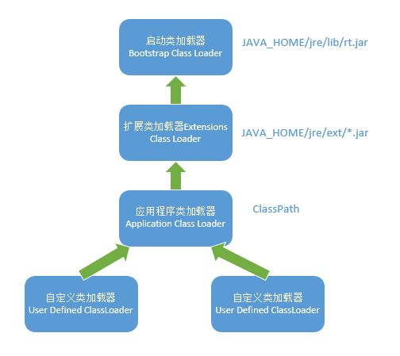

# Class

## getClassLoader()

获取类加载器对象

```java
public class Test {
    public static void main(String[] args) {
      System.out.println(Object.class.getClassLoader());
      // sun.security.ec.SunEC属于lib/ext下的jar里的类
      System.out.println(sun.security.ec.SunEC.class.getClassLoader());
      // ClassA为我们自己编写的一个类
      System.out.println(ClassA.class.getClassLoader());
    }
}

// 输出
null
sun.misc.Launcher$ExtClassLoader@6ff3c5b5
sun.misc.Launcher$AppClassLoader@18b4aac2
```

如果熟悉JVM中的类加载机制，后面输出的两句没什么问题：

`ExtClassLoader`加载`lib/ext`文件夹下的类

`AppClassLoader`加载我们自定义编写的类

我们知道`Object`属于`lib`下的`rt.jar`，这个目录下的类是由`BootstrapClassLoader`加载的，那么为什么输出为null?

先看一下类加载器结构图



可以知道`ExtClassLoader`的父类是`BootstrapClassLoader`，我们尝试打印一下`ExtClassLoader`的父类

```java
public class Test {
    public static void main(String[] args) {
      // 使用getParent()方法
      System.out.println(sun.security.ec.SunEC.class.getClassLoader().getParent());
    }
}

// 输出
null
```

可见类加载器为`BootstrapClassLoader`的输出都是null。

原因是：

>Bootstrap ClassLoader是由C/C++编写的，它本身是虚拟机的一部分，所以它并不是一个JAVA类，也就是无法在java代码中获取它的引用，JVM启动时通过Bootstrap类加载器加载rt.jar等核心jar包中的class文件，之前的int.class,String.class都是由它加载。然后呢，我们前面已经分析了，JVM初始化sun.misc.Launcher并创建Extension ClassLoader和AppClassLoader实例。并将ExtClassLoader设置为AppClassLoader的父加载器。Bootstrap没有父加载器，但是它却可以作用一个ClassLoader的父加载器。比如ExtClassLoader。这也可以解释之前通过ExtClassLoader的getParent方法获取为Null的现象
可知由于BootstrapClassLoader对Java不可见,所以返回了null,我们也可以通过某一个类的加载器是否为null来作为判断该类是不是使用BootstrapClassLoader进行加载的依据。