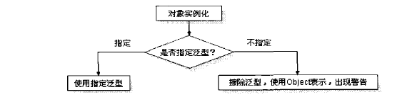

# 泛型

## 泛型的作用

### 为什么需要泛型？

举个例子，假如有个Point类用于存储一些坐标信息。而我们知道，坐标有各种坐标，比方说点的坐标就属于（x,y），经纬度坐标（东经99度，北纬37度），围棋坐标（1，30）诸如此类等等。这些坐标存储的数据类型可能一样，但绝大多数情况下不一样。

假设以上面例子来说，这时候我们存储点坐标写个Ponit类：


```java
public class Ponit {
    
    private double x;
    private double y;
    
    public double getX() {
		return x;
	}
    
    public double getY() {
		return y;
	}
    
    public void setX(double x) {
        
        this.x = x;
    }
    
    public void setY(double y) {
        
        this.y = y;
    }
}
```


上述类只是为了存储点的位置信息，这时有以下问题：

1.这时如果我们又需要存储经纬度或其他信息，难道再新建一个类声明类型为String吗？这样不会太累吗？

2.又或者说直接在Point类里加成员变量？这样不会太复杂吗？

3.你可能会抬杠说我用Object类就够了，到时再转换取值！那样很累吧，何况如果存储的是一个对象呢？

这里就需要用到泛型(Generic)了。而且，使用Object类当接收参数可能会出现以下非检查时异常：


```java
public class Point2 {

	private double x;
    private double y;
    
    public void setX(Object x) {
        
        this.x = (Double)x;
    }
    
    public void setY(Object y) {
        
        this.y = (Double)y;
    }
    
    public static void main (String[] args) {
        
        Point2 point2 = new Point2();
        point2.setX(12.2);       
        point2.setY("123.2");    // 此句代码会报错，ClassCastException,String -> Double 
        // point2.setX(12)          也会报错，因为转型为int -> Integer -> Object -> Double 
    }
}
```


虽然现在看起来问题很明了，都是类型转换错误，但是编译前并不会进行报错，所以出错率还是挺高的。

所以泛型就诞生了。


## 泛型类

先写个简单的**泛型类**：


```java
public class public Point<T> {
    
    private T x;
    private T y;
    
    public T getX() {
		return x;
	}
	
	public T getY() {
		return y;
	}
	
	public void setX(T x) {
		this.x = x;
	}
	
	public void setY(T y) {
		this.y = y;
	}
}
```


现在我们还是用上面的case，传入坐标信息，来试用下泛型类。


```java
public class TestMain {

	public static void main(String[] args) {
		
		// 传入坐标信息x,y
		Point<Double> point = new Point<>(); // 这里注意，泛型只能是对象
		
		point.setX(12.3);
		point.setY(144.3);
		// point.setX("12");     此行报错,检查时异常

		// 传入经纬度坐标
		Point<String> point2 = new Point<>();
		point2.setX("东经99°");
		point2.setY("北纬22°");
		
		System.out.println("点的坐标为: " + point.getX() + "," + point.getY() );
		System.out.println("经纬度坐标为: " + point2.getX() + point2.getY());
	}
}

// 输出
点的坐标为: 12.3,144.3
经纬度坐标为: 东经99°北纬22°
```


可以看到，使用泛型既可以少写多余的重复代码，又可以有效防止转换错误。

### 多个泛型的泛型类以及泛型类的构造函数

请看代码就能明白


```java
public class Generic <K,V> {

	private K key;
	private V value;
	
	public Generic(K key, V value) {
		
		this.key = key;
		this.value = value;
	}
	
	@Override
	public String toString() {

		return ""+ key + value;
	}
    // get,set
	
	public static void main(String[] args) {
		
		Generic<Integer, String> generic = new Generic<Integer, String>(100, "分");
		System.out.println(generic.toString());
	}
}

// 输出
100分
```

### 未指定泛型

假如定了一个泛型类，而在实例化时并未进行泛型指定，则默认泛型为Object型。



```java
Point point3 = new Point();  // 警告
point3.setX(123d);           // 警告
System.out.println("x :" + point3.getX());     

-----------------等价于---------------------
    
Point<Object> point3 = new Point<Object>();
point3.setX(123d);
System.out.println("x :" + point3.getX());

// 输出
x :123.0
```


## 泛型方法

首先先明确，泛型方法可以定义在所有类中，即非泛型类和泛型类都可以定义泛型方法。定义泛型方法格式如下：


```java
public class UsualClass {     		// 在普通类中定义
    
    public <T> T print (T t) {      // 定义非静态泛型方法
        
       	// to do
        return t;
    }
    
    public static <G> G staticMethod (G g) {      // 定义静态泛型方法，static关键字在<>前面
        
       	// to do
        return g;
    }
}
```


其实与在普通类中一样，在泛型类中定义其实也是一样的，但这里为了记住泛型类所指定的泛型和方法中的可以不一致所以特地挑出来说。


```java
public class <T> GenericClass {
    
    private T var;
    
    public T getVar () {
        
        return var;
    }
    
    public class GenericClass (T var) {
        
        this.var = var;
    }
    
    public static <G> G method (G g) {    // 仍可以定义泛型为G的方法，但一般都是静态方法
        
        //to do
        return g;
    }
  
  	// 注意这里String T Invain三个类型接是范型的指代
  	// 也就是说String只是个标识，并不是java.lang.String,同理Invain
  	// T也并非是上面的T，这里T可以换成任意的标识
  	// 参数也属于可变的，你可以不定义，或者形参类型属于这三个即可，不限定个数
  	// 由于与类无关，一般也是用作静态方法
    public <String, T, Invain> String getName(String a, Invain fruit) {
          return a;
    }

}
```


针对泛型方法列出几点关键

1. 可以没有返回值

2. **如果与类的泛型指定的不一致，则为了使用参数以及确定泛型类型，必须传入参数，因为无法使用泛型类的成员变量。**

3. 调用方法时最好是写成对象.<泛型>方法名(方法参数)的写法，虽然在Java7和8中已经可以省略，但尽量写吧，因为省略的原理是编译器利用type inference自动导出相应的参数。

4. 假如方法并没有指定类型参数，那么他们的原始类型为同一父类的最小级

   ```java
   public class Test2{  
       public static void main(String[] args) {  
           /**不指定泛型的时候*/  
           int i=Test2.add(1, 2); 			// 这两个参数都是Integer，所以T为Integer类型  
           Number f=Test2.add(1, 1.2);		// Integer和Float，取同一父类的最小级，为Number  
           Object o=Test2.add(1, "asd");	// Integer和String，取同一父类的最小级，为Object  
   
       // 这是一个简单的泛型方法  
       public static <T> T add(T x,T y){  
           return y;  
       }  
   }  
   ```


## 限定

讲述这个概念之前先来看一个例子


```java
public static <T> T min (T[] a) {
		
		int len = a.length;
		if (a == null || len == 0) return null;
		T smallest = a[0];
		
		for (int i = 1; i < len; i++) {
			
			if (smallest.compareTo(a[i]) > 0) {    // 只有实现了Comparable接口的类才有此方法
				
				smallest = a[i];
			}
		}
		
		return smallest;
}
```


上面注释写的很清楚了，而且上述代码在编译阶段其实就会提示报错了，正确的写法应该如下


```java
public static <T extends Comparable<T>> T min (T[] a) {
		
		int len = a.length;
		if (a == null || len == 0) return null;
		T smallest = a[0];
		
		for (int i = 1; i < len; i++) {
			
			if (smallest.compareTo(a[i]) > 0) {
				
				smallest = a[i];
			}
		}
		
		return smallest;
}
```


其实`Comparable`本身就是个泛型接口，但也只有实现了此接口的类才有`compareTo()`这个方法，故如果有类想使用这个方法，必须实现`Comparable`接口，这就是**限定了泛型的上界**。

1.为什么用`extends`关键字而不是`implement`关键字呢？

答：其实T可以是 接口也可以是类，选择`extends`的原因是更接近于子类的概念。

注：假如有多个绑定类型`<K,V>`此时要分开继承即


```java
public class Generic <K extends Comparable, V extends Object>
```


同时，一个绑定类型可以有多个限定，用"&"来分隔，但注意，**只可有一个类且必须写在第一个，后续都为接口**。


```java
public class Generic<K extends Parent & Comparable> 
```


还要记住的是，限定只有上限`extends`，无`super`，请不要与通配符混淆。比较直白的就是限定只作用于定义时，即类定义或方法定义；而通配符一般都是作用于接收参数，并且通配符可以让泛型实现转型，而限定不能。举个例子，一个`ArrayList< Manager >`可以被转换为`List< Manager >`,但是一个`ArrayList< Manager >`跟`ArrayList< Employee >`没有关系，而通配符可以使得二者有关系。


## 擦除（erased）

### 引入

首先附上经典的例子：


```java
List<String> l1 = new ArrayList<>();
List<Integer> l2 = new ArrayList<>();

System.out.println(l1.getClass() == l2.getClass());

//输出
true
```


为什么会输出这个结果呢？要知道，虚拟机是没有泛型这一类的，我们所写的泛型类在编译时会自动擦除。所以上述比较其实是在 `jvm` 中的 `Class `都是` List.class`，故为`true`。

那么`String`和`Integer`怎么办？

答案是泛型翻译。（下面会解释）


### 擦除的定义


就如我们上面所说，对于虚拟机来说，泛型是不存在的。所以在编译时，我们对类或方法定义的类型参数会被擦除掉，请看代码


```java
public class Erased <T> {
    
    private T var;
    
    public T getVar () {
        
        return var;
    }
    
    public void setVar (T var) {
        
        this.var = var;
    }
}
```


上面是一个定义好的泛型类，而在编译器中不管`T`代表是哪个类，都将被擦除，上述代码等价于下面的代码


```java
public class Erased {
    
    private Object var;
    
    public Object getVar () {
        
        return var;
    }
    
    public Object setVar (Object var) {
        
        this.var = var;
    }
}
```


但并不是所有的类型参数都会被替换成`Object`类型，至于替换成什么类型，取决于该第一界限。例如

```java
public class Erased <T extends Comparable> {
    
    private T var;
    
    public T getVar () {
        
        return var;
    }
    
    public void setVar (T var) {
        
        this.var = var;
    }
}
```

会被替换为

```java
public class Erased {
    
    private Comparable var;
    
    public Comparable getVar () {
        
        return var;
    }
    
    public void setVar (Comparable var) {
        
        this.var = var;
    }
}
```


这里应该就明确了吧。

这里再来解释一开始说到的泛型翻译，就拿第一块代码来说

```java
// 假如我们在Main方法里写到

Erased <Integer> erased = new Erased<>();

Integer num = erased.getVar();

// 这里我们知道 getVar()返回的是一个Object对象
// 但会被编译器自动加入类型强制转换也就是说上述方法调用了两句话

Object obj = erased.getVar(); // 返回一个Object对象
num = (Integer) obj;
```


这里可能会出现一个问题，假设传入的是一个`Hello`类型，该类中有一个`hello()`方法，但我们在写泛型方法时是无法调用的，原因就是擦除后`Object`没有这个方法，所以解决办法就很简单，继承`hello`类即可。


### 擦除带来的问题

https://blog.csdn.net/zly921112/article/details/63686936

https://blog.csdn.net/briblue/article/details/76736356

https://blog.csdn.net/jeffleo/article/details/52250948

https://blog.csdn.net/PacosonSWJTU/article/details/50209661

https://www.cnblogs.com/xz816111/p/7643323.html

## 通配符

### 作用

我们知道限定无法使两个泛型展示多态，但通配符可以，以下是通配符的几种用法，请看以下代码


```java
List<?> u = new ArrayList<Parent>();

List<? super Son> s = new ArrayList<Parent>();   //Parent类为Son类的超类

List<? extends Parent> p = new ArrayList<Son>();

public void only(List<?> param){

}

public void readOnly(List<? extends Parent> param){

}

public void writeOnly(List<? super Son> param){

}
```


以上代码编译完全没问题，"?"即为通配符，它能**接收**任意类型，注意是任意。所以引用u便能接收任意泛型的`ArrayList`。**这里强调，通配符只能用于接收对象，例如方法的参数和对象的引用，而不能用于类定义**。


### 通配符分类

`<?>`：无限定通配符，没有限定范围，接收任意类型，不能写入除了`null`以外的对象，因为不知道传入的类型，所以读取时只能返回一个`Object`对象


```java
List<?> u = new ArrayList<Parent>();
		u.add(new Parent());         // 出错  
		u.get(0);                    // 返回的是一个Object类型对象
```


`<? extends Parent>`: 上限通配符，它与无限定通配符功能一致，唯一的不同就是它指定了范围，这样就导致`get`出来的对象最大就只能是`Parent`类，所以可以向下转型成子类


```java
List<? extends Parent> p = new ArrayList<Son>();
		p.add(new Parent());         // 同样不能写，只能读
		p.get(0);                    // 同样返回一个Parent类型对象
		String s = (String)p.get(0); // 出错，String对象并不是Parent的子类
        Son son = (Son)p.get(0);          // 正确， 向下转型

List<? extends Parent> p = new ArrayList<String>();   // 因为String并不是Parent的子类，报错
```


这里解释下为什么不能写入，拿上述例子来说，当你指定了一个`List<? extends Parent>`，add的参数也自动变为

`“? extends Parent”`,此时编译器并不能知道到底需要哪种`Parent`的子类，因此他不会接受任何类型的`Parent`。

可以想想`List<T>`添加元素,只能添加本身或子类,例子：

```java
// Apple extends Fruit, Orange extends Fruit
List<? extends Fruit> flist = new ArrayList<Fruit>();
List<? extends Fruit> flist = new ArrayList<Apple>();
List<? extends Fruit> flist = new ArrayList<Orange>();
```

当你去`add`一个对象时，你并不知道flist目前指向的是谁。假如当前指向`ArrayList<Apple>()`, 而你却添加了`Fruit`，很明显`ArrayList<Apple>()`无法添加一个`Fruit`对象，因为此时编译器并不知道到底指向了哪个`Fruit`的对象。


`<? super Son>`: 下限通配符，它与上限通配符相反，能写入**部分**对象，同时也能获取`Object`对象，但编译器并不知道这到底是哪个父类的对象，所以`get`只能返回`Object`类型。


```java
List<? super Son> s = new ArrayList<Parent>();
        s.add(new Son());
        s.add(new GrandSon());
		s.add(new Parent());     //报错
		s.add(new Object());     //报错
		
		s.get(0);				//返回一个Object对象，可以强转，但会造成信息丢失             
```


因为容器里存放的**所有**的父类对象，所以只能添加他们的共同子类。换句话说，往容器里添加一个父类，而基类的父类可能有多个，编译器根本不知道你添加的到底是哪个父类，所以**只能添加共同的子类或者继承这个子类的类**。  

拿上面的例子说，因为`Son`是共同子类，所以不管指向哪个父类，父类调用`add()`，都能添加`Son`对象。但获取时，由于不知道指向哪个对象，所以也就无法获取对象，所以给了个伪上界`Obejct`。


那么问题来了，无限定通配符比不上下面这两个，那他有啥用？

```java
 public static boolean isNull(Pair<?> pair){
     
    return pair.getFirst() != null || pair.getSecond() != null;
 }
```

从上面代码中可以看到，它能判断为空操作，而不需要知道具体类型，非常好使。


### PESC原则

根据上面的例子，我们可以总结出一条规律，”Producer Extends, Consumer Super”：

- “Producer Extends” – 如果你需要一个只读List，用它来produce T，那么使用`? extends T`。
- “Consumer Super” – 如果你需要一个只写List，用它来consume T，那么使用`? super T`。
- 如果需要同时读取以及写入，那么我们就不能使用通配符了


### 通配符与限定

限定只有`<T extends>`，一旦`T`确定了类型，就等于只接收`T`类型的对象，也就是说一旦定义好了，它的指向就确定了，`add`时添加自身及子类(确定一定类型一定为`Person`)，`get`时全部都是`Person`对象（向上转型)。

而`?`是接收在限界内的任意的对象，会随着指向而发生改变，由于不能作用于类定义，故只有在引用时传入。

## 资料

> https://segmentfault.com/a/1190000005179142