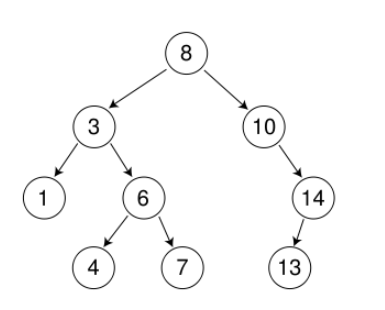
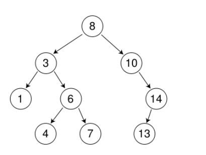
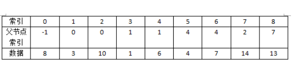
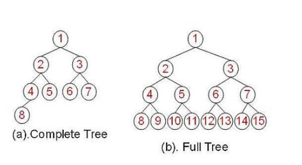
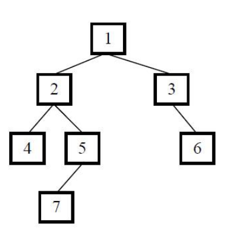

# Tree

## 基本概念


- 树是一种非线性结构。我们所悉知的数组及链表都是线性结构，也就是一对一的关系。而树是一对多的关系，图则是多对多。
- 它是由n（n >= 0 ) 个结点组成的有限集合。
- 若n = 0，则称树为空树，反之 n > 0时，它有且只有一个根节点，根节点没有前驱节点，只有若干后继节点。
- parent是双亲节点，又称前驱节点，child为子节点，又称后继节点。
- leaf即叶子节点，没有任何子节点的节点成为叶子节点。
- 每个节点都是一个集合，所以每个节点都是根节点的一颗子树。


## 相关术语




****

**节点的度**：每个节点的子节点个数，图中根节点度为2，节点14度为1。

**树的度**：一棵树中节点最大的度，图中单个节点最大的度为2，所以树的度为2。

**节点层次**：自顶而下递增，例如根节点为第一层，6为第三层。

**树的高度**：自底而上递增，根节点高度最高，高度为1的一定是叶子节点，图中3的高度为3。

**树的深度**：自顶而下递增，根节点深度为1，图中4的深度为4。


**可以看出，树其实就是一个递归。因为每个子节点只有一个父节点，每个子节点又是一棵树，以此递归。**


## 实现

### 基于数组

```java
public class TreeNode {

    private Object mData;   //存储的数据
    private int mParent;   //父亲节点的下标

    public TreeNode(Object data, int parent) {
        mData = data;
        mParent = parent;
    }

    public Object getData() {
        return mData;
    }

    public void setData(Object data) {
        mData = data;
    }

    public int getParent() {
        return mParent;
    }

    public void setParent(int parent) {
        mParent = parent;
    }
}
```








### 基于链表

```java
public class LinkedTreeNode {

    private Object mData;   //存储的数据
    private LinkedTreeNode mParent;   //父亲节点的下标
    private List<LinkedTreeNode> mChildNodeList;    //孩子节点的引用

    public LinkedTreeNode(Object data, LinkedTreeNode parent) {
        mData = data;
        mParent = parent;
    }

    public Object getData() {
        return mData;
    }

    public void setData(Object data) {
        mData = data;
    }

    public Object getParent() {
        return mParent;
    }

    public void setParent(LinkedTreeNode parent) {
        mParent = parent;
    }

    public List<LinkedTreeNode> getChild() {
        return mChildNodeList;
    }

    public void setChild(List<LinkedTreeNode> childList) {
        mChildNodeList = childList;
    }
}
```


## 二叉树

### 定义

二叉树是个有限节点的集合，这个集合可以是空集。也可以是根节点和至多两个子二叉树组成的集合，其中一棵叫左子树，另一棵叫右子树。

简单地说，二叉树就是每个节点**至多**有两个子树的树。


### 特殊二叉树

#### 满二叉树

**定义：**如果一棵树的高度为k，且拥有2^k-1个节点，则称这棵树为满二叉树。

#### 完全二叉树

**定义**：对于高度为k的树，所有的叶子节点都出现在k层或k-1层，且从1层到k-1层都必须达到最大节点数；第k层可以是不满的，但 所有的节点都必须出现在左边。


#### 二者对比图




### 二叉树的实现


**节点类**

```java
public class BinaryTreeNode {

	private int data;
	private BinaryTreeNode mLeftChild;
	private BinaryTreeNode mRightChild;

	public BinaryTreeNode (int data, BinaryTreeNode leftChild, BinaryTreeNode rightChild) {
		
		this.data = data;
		mLeftChild = leftChild;
		mRightChild = rightChild;
	}
	
	public int getData() {

		return data;
	}

	public void setData(int data) {

		this.data = data;
	}

	public BinaryTreeNode getmLeftChild() {

		return mLeftChild;
	}

	public void setmLeftChild(BinaryTreeNode mLeftChild) {

		this.mLeftChild = mLeftChild;
	}

	public BinaryTreeNode getmRightChild() {

		return mRightChild;
	}

	public void setmRightChild(BinaryTreeNode mRightChild) {

		this.mRightChild = mRightChild;
	}
}
```


**实现类**

```java
public class BinaryTree {

	private BinaryTreeNode mRoot;

	public BinaryTreeNode getmRoot() {
		
		return mRoot;
	}

	public void setmRoot(BinaryTreeNode mRoot) {
		
		this.mRoot = mRoot;
	}
}
```


### 二叉树添加元素

```java
private void checkTreeEmpty () {
		
		if (mRoot == null) {
			
			throw new IllegalArgumentException("Can't insert to a null tree! Did you forget set value for root?");
		}			
	}
	
	/**
	 * 设置左子树
	 * @param child
	 */
	public void insertAsLeftChild (BinaryTreeNode child) {
		
		checkTreeEmpty();
		mRoot.setmLeftChild(child);
	}
	
	/**
	 * 设置右子树
	 * @param child
	 */
	public void insertAsRightChild (BinaryTreeNode child) {
		
		checkTreeEmpty();
		mRoot.setmRightChild(child);
}
```


### 二叉树删除元素

```java
public void deleteNode (BinaryTreeNode node) {
		
		if (node == null) {   //递归出口
			
			return;
		}
		
		deleteNode(node.getmLeftChild());
		deleteNode(node.getmRightChild());
		node = null;
}
```


### 二叉树的清空

```java
public void clear () {
		
		if (mRoot != null) {
			
			deleteNode(mRoot);
		}
}
```


### 二叉树高度

```java
public int getTreeHeight () {
		
	return getHeight(mRoot);
}

/**
 * 获取指定节点高度
 * @param node
 * @return
 */
public int getHeight (BinaryTreeNode node) {
		
	if (node == null) { //递归出口
			
		return 0;
	}
		
	int leftTreeHeight = getHeight(node.getmLeftChild());
	int rightTreeHeight = getHeight(node.getmRightChild());
		
	int max = Math.max(leftTreeHeight, rightTreeHeight);
		
	return max + 1;
}
```


### 二叉树节点数

```java
    /**
	 * 获取树的度
	 * @return
	 */
	public int getSize () {
		
		return getChildSize(mRoot);
	}
	
	/**
	 * 获取节点的度
	 * @param node
	 * @return
	 */
	public int getChildSize (BinaryTreeNode node) {
		
		if (node == null) {
			
			return 0;
		}
		
		int leftNum = getChildSize(node.getmLeftChild());
		int rightNum = getChildSize(node.getmRightChild());
		
		return leftNum + rightNum + 1;
	}
```


### 获取父亲节点

```java
    public BinaryTreeNode getParent (BinaryTreeNode node) {
		
		if (node == null || mRoot == node) {
			
			return null;
		}
		
		return getParentNode(mRoot, node);
	}
	
	public BinaryTreeNode getParentNode (BinaryTreeNode subTree, BinaryTreeNode node) {
		
		if (subTree == null) {
			
			return null;
		}
		
		if (subTree.getmLeftChild() == node || subTree.getmRightChild() == node) {
			
			return subTree;
		}
		
		BinaryTreeNode parent;
		if ((parent = getParentNode(subTree.getmLeftChild(), node)) != null) {
			
			return parent;
		} else {
			
			return getParentNode(subTree.getmRightChild(), node);
		}
	}
```


### 遍历

#### 前序遍历

- 先访问根节点
- 再先序遍历左子树
- 再先序遍历右子树
- 退出

注意在访问子树时，也要根据上述要求来进行遍历。

```java
     public void iteratorFirstOrder (BinaryTreeNode node) {
		
		if (node == null) {
			
			return;
		}
		
		operate(node);    //先根节点
		iteratorFirstOrder(node.getmLeftChild());  //再左子树
		iteratorFirstOrder(node.getmRightChild()); //最后右子树
	}
	
	public void operate (BinaryTreeNode node) {
		
		//这里进行遍历操作
		System.out.println(node.getData());
	} 
```


#### 中序遍历

- 先中序遍历左子树
- 再访问根节点
- 再中序遍历右子树
- 退出

注意在访问子树时，也要根据上述要求来进行遍历。

```java
    /**
	 * 中序遍历
	 * @param node
	 */
	public void iteratorMediumOrder (BinaryTreeNode node) {
		
		if (node == null) {
			
			return;
		}
		
		iteratorMediumOrder(node.getmLeftChild());
		operate(node);
		iteratorMediumOrder(node.getmRightChild());
	}
```


#### 后序遍历

- 先后序遍历左子树
- 再后序遍历右子树
- 最后访问根节点
- 退出

注意在访问子树时，也要根据上述要求来进行遍历。

```java
    /**
	 * 后续遍历
	 * @param node
	 */
	public void iterateLastOrder (BinaryTreeNode node) {
		
		if (node == null) {
			
			return;
		}
		
		iterateLastOrder(node.getmLeftChild());
		iterateLastOrder(node.getmRightChild());
		operate(node);
	}
```


#### 遍历小结



**前序遍历输出：**

1245736

**中序遍历输出：**

4275136

**后续遍历输出：**

4752631


## 二叉搜索树