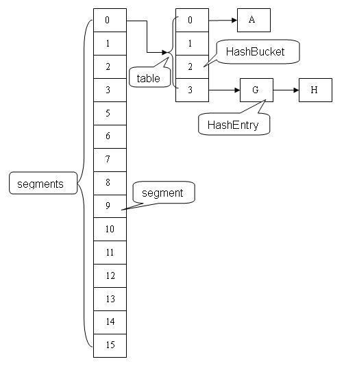
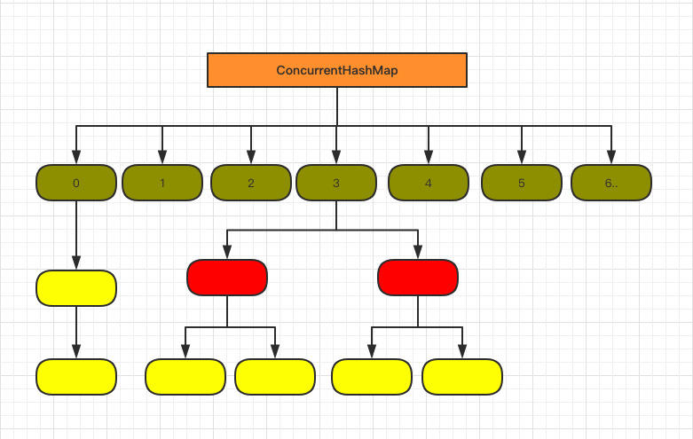

# ConcurrentHashMap

## 1.7以前与1.8版本的区别

### 1.7版本

1.7采用的是分段锁Segment机制，底层与HashMap一样，都是采用数组+链表的数据结构存储。



核心思想是将锁的粒度细化，对某个Segment操作时不影响其他Segment的操作，相比HashTable锁对象的效率挺高了不少。

锁的个数为segment的数量，可以在构造时传入设置。

### 1.8版本

1.8所采用技术是CAS+Synchronized。由于JDK8中JVM对Synchronized已经进行了优化，故1.8版本的直接采用Synchronized，所以结构上跟1.8版本的HashMap没什么区别。



锁的个数为数组的size，即每个桶都有一把锁，无需自己设置。

## 方法源码分析

### 重要成员参数

```java
// 1.用于控制初始化数组以及扩容。
// 	 -1代表正在扩容或初始化，若果值是-1 + n代表有n个线程协助扩容，最大为65534（低16位），初始化则让出
// 2.以下皆是针对数组初始化。当数组为空时，首先存储的是需要初始化数组的容量，0代表的是使用默认容量。
// 	 初始化之后存储的是下一个需要扩容的阙值，对应HashMap的threshold，等到扩容时再CAS改为-1
private transient volatile int sizeCtl;

// 一个桶的根节点的hash值设置为此，代表这个桶正在扩容移动
static final int MOVED     = -1;
// 链表转为红黑树之后，设置根节点hash为此值，故判断hash大于0为链表
static final int TREEBIN   = -2;
```

### initTable()

```java
private final Node<K,V>[] initTable() {
  Node<K,V>[] tab; int sc;
  // 当数组为空时，初始化数组
  while ((tab = table) == null || tab.length == 0) {
    // 如果sc小于0代表已经有线程在初始化，其他线程只能等待
    if ((sc = sizeCtl) < 0)
      Thread.yield(); // lost initialization race; just spin
    // 此时sc > 0，证明之前并没有线程进入，当前线程进行数组初始化，CAS替换sc为-1，SIZECTL为内存偏移量
    // 如果其他线程走到这，CAS会失败，while循环后进入上面的if分支等待
    else if (U.compareAndSwapInt(this, SIZECTL, sc, -1)) {
      try {
        // 双重检验，防止后续线程在初始化完成后再次初始化
        if ((tab = table) == null || tab.length == 0) {
          // 如果sc=0代表使用默认容量，否则使用传入的容量
          int n = (sc > 0) ? sc : DEFAULT_CAPACITY;
          @SuppressWarnings("unchecked")
          // 构建数组
          Node<K,V>[] nt = (Node<K,V>[])new Node<?,?>[n];
          table = tab = nt;
          // 设置扩容阙值为0.75n
          sc = n - (n >>> 2);
        }
      } finally {
        // 初始化数组完毕，把扩容阙值设置给sizeCtl
        sizeCtl = sc;
      }
      break;
    }
  }
  return tab;
}
```

### put()

```java
public V put(K key, V value) {
  return putVal(key, value, false);
}

final V putVal(K key, V value, boolean onlyIfAbsent) {
  // 非空检验
  if (key == null || value == null) throw new NullPointerException();
  // 计算hash值
  int hash = spread(key.hashCode());
  // 用于标记桶里数据结构（如果是链表则是链表长度，树则是2），并于最后增加长度方法里表示需要扩容检验
  int binCount = 0;
  // 
  for (Node<K,V>[] tab = table;;) {
    // f标记为桶的第一个元素
    // n为数组当前长度
    // i为key在数组的位置
    // fh用于后续操作，也是hash值
    Node<K,V> f; int n, i, fh;
    // 如果数组未初始化则进行初始化
    if (tab == null || (n = tab.length) == 0)
      tab = initTable();
    // 这里使用的tabAt是CAS实现的，为了保证可见性，虽然table引用被volatile修饰，但tab并没有
    // 即“volatile的数组只针对数组的引用具有volatile的语义，而不是它的元素”
    else if ((f = tabAt(tab, i = (n - 1) & hash)) == null) {
      // 如果这个位置是空的，则CAS创建一个节点，结束循环
      if (casTabAt(tab, i, null,
                   new Node<K,V>(hash, key, value, null)))
        break;                   // no lock when adding to empty bin
    }
    // 如果当前头节点位置的hash为MOVED，证明这个桶正在扩容，当前线程可以帮助扩容
    else if ((fh = f.hash) == MOVED)
      tab = helpTransfer(tab, f);
    // 否则需要锁定这个桶（锁的是头节点）进行遍历插入
    else {
      V oldVal = null;
      // jdk1.6之后synchronize进行了很大的提升
      synchronized (f) {
        if (tabAt(tab, i) == f) {
          // 如果是红黑树fh为-2，大于0代表还是链表
          if (fh >= 0) {
            // 设置binCount初始值为1
            binCount = 1;
            // 循环查询链表，累加binCount，所以binCount即是查询的节点数
            for (Node<K,V> e = f;; ++binCount) {
              K ek;
              // 如果存在这个节点，则根据onlyIfAbsent判断是否替换这个值，跳出for循环
              if (e.hash == hash &&
                  ((ek = e.key) == key ||
                   (ek != null && key.equals(ek)))) {
                oldVal = e.val;
                if (!onlyIfAbsent)
                  e.val = value;
                break;
              }
              // 将当前节点赋值给pred，查找下一个节点
              Node<K,V> pred = e;
              // 如果当前节点是末尾节点，证明链表不存在这个key
              if ((e = e.next) == null) {
                // 新增一个节点，结束循环
                pred.next = new Node<K,V>(hash, key,
                                          value, null);
                break;
              }
            }
          }
          // 如果桶里的结构是红黑树
          else if (f instanceof TreeBin) {
            Node<K,V> p;
            // 将binCount设置为2
            binCount = 2;
            // 插入节点，调整树结构，如果返回的oldValue不为null，代表存在这个节点了
            if ((p = ((TreeBin<K,V>)f).putTreeVal(hash, key,
                                                  value)) != null) {
              oldVal = p.val;
              if (!onlyIfAbsent)
                p.val = value;
            }
          }
        }
      }
      // 至此，插入已经结束，接下来是判断是否需要树化及扩容
      // binCount不为0代表进行过插入或替换操作
      if (binCount != 0) {
        // 是否需要树化
        if (binCount >= TREEIFY_THRESHOLD)
          treeifyBin(tab, i);
        // 如果是替换，则不需要进行addCount()
        if (oldVal != null)
          return oldVal;
        break;
      }
    }
  }
  // 如果是插入不是替换，进行扩容检查以及整体长度+1
  addCount(1L, binCount);
  return null;
}
```

综合来看，插入操作主要流程为：

1. 参数校验
2. 查看表是否需要初始化，如果需要则执行`initTable()`方法
3. 使用hash值计算桶在数组的位置，判断桶是否存在，如果不存在则创建桶结束插入操作
4. 如果桶存在，先检查头节点的hash值是否为MOVE（-1）正在扩容，如果是则帮助扩容
5. 如果不在扩容，则可以操作桶，需要使用synchronized关键字将桶锁住，进行插入操作
6. 判断是链表还是红黑树，进行插入或替换操作
7. 桶是否需要树化
8. 增加size长度，扩容检验

### addCount()

`addCount()`主要分为两部分，一部分是元素计数+x，一部分是根据参数k进行扩容检查

```java
private final void addCount(long x, int check) {
  CounterCell[] as; long b, s;
  // 第一部分
  // 如果计数单元不为空，并且CAS增加长度失败
  if ((as = counterCells) != null ||
      !U.compareAndSwapLong(this, BASECOUNT, b = baseCount, s = b + x)) {
    CounterCell a; long v; int m;
    boolean uncontended = true;
    // 计数单元为空（没有出现并发）
    // 或者 随机对计数单元数组取余一个数组位置为空
    // 或者 修改该位置的值为原来的值+1失败
    // 则执行fullAddCount()结束
    if (as == null || (m = as.length - 1) < 0 ||
        (a = as[ThreadLocalRandom.getProbe() & m]) == null ||
        !(uncontended =
          U.compareAndSwapLong(a, CELLVALUE, v = a.value, v + x))) {
      // 类似LongAdder，这里不展开
      fullAddCount(x, uncontended);
      return;
    }
    // 是否需要检查
    if (check <= 1)
     	 return;
    // 获取当前size
    s = sumCount();
  }
  // 第二部分
  if (check >= 0) {
    Node<K,V>[] tab, nt; int n, sc;
    // 如果当前的元素个数大于sizeCtl（当前存储的是扩容阙值），且可进行扩容
    while (s >= (long)(sc = sizeCtl) && (tab = table) != null &&
           (n = tab.length) < MAXIMUM_CAPACITY) {
      // 计算获得一个扩容标识
      int rs = resizeStamp(n);
      // 如果sc小于0代表正在扩容，其他线程可以进行协助
      if (sc < 0) {
        // 此时sc已经被替换，右移16位后得到标识
        // 当第一个线程结束扩容了，就会将 sc 减一。这个时候，sc 就等于 rs + 1）
        // 如果 sc == 标识符 + 65535（帮助线程数已经达到最大，低16位已经全部填满）
        // 如果 nextTable == null（结束扩容了）
        // 如果 transferIndex <= 0 (转移状态变化了)
        // 结束循环
        if ((sc >>> RESIZE_STAMP_SHIFT) != rs || sc == rs + 1 ||
            sc == rs + MAX_RESIZERS || (nt = nextTable) == null ||
            transferIndex <= 0)
          break;
        // 如果可以帮助扩容，那么将 sc 加 1. 表示多了一个线程在帮助扩容
        if (U.compareAndSwapInt(this, SIZECTL, sc, sc + 1))
          // 扩容
          transfer(tab, nt);
      }
      // CAS替换sc的值为标识位左移16位（RESIZE_STAMP_SHIFT为16）+ 2得到一个负数
      // 这个数高 16 位是标识符，低 16 位初始是 2.
      else if (U.compareAndSwapInt(this, SIZECTL, sc,
                                   (rs << RESIZE_STAMP_SHIFT) + 2))
        // 进行扩容
        transfer(tab, null);
      // 获取当前size（因为可能存在并发情况，再次检验），不满足继续执行while
      s = sumCount();
    }
  }
}
```

### transfer()

暂时不解读

```java
private final void transfer(Node<K,V>[] tab, Node<K,V>[] nextTab) {
  int n = tab.length, stride;
  if ((stride = (NCPU > 1) ? (n >>> 3) / NCPU : n) < MIN_TRANSFER_STRIDE)
    stride = MIN_TRANSFER_STRIDE; // subdivide range
  if (nextTab == null) {            // initiating
    try {
      @SuppressWarnings("unchecked")
      Node<K,V>[] nt = (Node<K,V>[])new Node<?,?>[n << 1];
      nextTab = nt;
    } catch (Throwable ex) {      // try to cope with OOME
      sizeCtl = Integer.MAX_VALUE;
      return;
    }
    nextTable = nextTab;
    transferIndex = n;
  }
  int nextn = nextTab.length;
  ForwardingNode<K,V> fwd = new ForwardingNode<K,V>(nextTab);
  boolean advance = true;
  boolean finishing = false; // to ensure sweep before committing nextTab
  for (int i = 0, bound = 0;;) {
    Node<K,V> f; int fh;
    while (advance) {
      int nextIndex, nextBound;
      if (--i >= bound || finishing)
        advance = false;
      else if ((nextIndex = transferIndex) <= 0) {
        i = -1;
        advance = false;
      }
      else if (U.compareAndSwapInt
               (this, TRANSFERINDEX, nextIndex,
                nextBound = (nextIndex > stride ?
                             nextIndex - stride : 0))) {
        bound = nextBound;
        i = nextIndex - 1;
        advance = false;
      }
    }
    if (i < 0 || i >= n || i + n >= nextn) {
      int sc;
      if (finishing) {
        nextTable = null;
        table = nextTab;
        sizeCtl = (n << 1) - (n >>> 1);
        return;
      }
      if (U.compareAndSwapInt(this, SIZECTL, sc = sizeCtl, sc - 1)) {
        if ((sc - 2) != resizeStamp(n) << RESIZE_STAMP_SHIFT)
          return;
        finishing = advance = true;
        i = n; // recheck before commit
      }
    }
    else if ((f = tabAt(tab, i)) == null)
      advance = casTabAt(tab, i, null, fwd);
    else if ((fh = f.hash) == MOVED)
      advance = true; // already processed
    else {
      synchronized (f) {
        if (tabAt(tab, i) == f) {
          Node<K,V> ln, hn;
          if (fh >= 0) {
            int runBit = fh & n;
            Node<K,V> lastRun = f;
            for (Node<K,V> p = f.next; p != null; p = p.next) {
              int b = p.hash & n;
              if (b != runBit) {
                runBit = b;
                lastRun = p;
              }
            }
            if (runBit == 0) {
              ln = lastRun;
              hn = null;
            }
            else {
              hn = lastRun;
              ln = null;
            }
            for (Node<K,V> p = f; p != lastRun; p = p.next) {
              int ph = p.hash; K pk = p.key; V pv = p.val;
              if ((ph & n) == 0)
                ln = new Node<K,V>(ph, pk, pv, ln);
              else
                hn = new Node<K,V>(ph, pk, pv, hn);
            }
            setTabAt(nextTab, i, ln);
            setTabAt(nextTab, i + n, hn);
            setTabAt(tab, i, fwd);
            advance = true;
          }
          else if (f instanceof TreeBin) {
            TreeBin<K,V> t = (TreeBin<K,V>)f;
            TreeNode<K,V> lo = null, loTail = null;
            TreeNode<K,V> hi = null, hiTail = null;
            int lc = 0, hc = 0;
            for (Node<K,V> e = t.first; e != null; e = e.next) {
              int h = e.hash;
              TreeNode<K,V> p = new TreeNode<K,V>
                (h, e.key, e.val, null, null);
              if ((h & n) == 0) {
                if ((p.prev = loTail) == null)
                  lo = p;
                else
                  loTail.next = p;
                loTail = p;
                ++lc;
              }
              else {
                if ((p.prev = hiTail) == null)
                  hi = p;
                else
                  hiTail.next = p;
                hiTail = p;
                ++hc;
              }
            }
            ln = (lc <= UNTREEIFY_THRESHOLD) ? untreeify(lo) :
            (hc != 0) ? new TreeBin<K,V>(lo) : t;
            hn = (hc <= UNTREEIFY_THRESHOLD) ? untreeify(hi) :
            (lc != 0) ? new TreeBin<K,V>(hi) : t;
            setTabAt(nextTab, i, ln);
            setTabAt(nextTab, i + n, hn);
            setTabAt(tab, i, fwd);
            advance = true;
          }
        }
      }
    }
  }
}
```

### get()

```java
public V get(Object key) {
  Node<K,V>[] tab; Node<K,V> e, p; int n, eh; K ek;
  // 计算hash值（用于负数转正数）
  int h = spread(key.hashCode());
  // 数组非空，使用tabAt获取桶的根节点，判断是否为空
  if ((tab = table) != null && (n = tab.length) > 0 &&
      (e = tabAt(tab, (n - 1) & h)) != null) {
    // 如果是根节点，切key相等，直接返回
    if ((eh = e.hash) == h) {
      if ((ek = e.key) == key || (ek != null && key.equals(ek)))
        return e.val;
    }
    // 如果hash小于0，即为红黑树（eh为-2）
    else if (eh < 0)
      return (p = e.find(h, key)) != null ? p.val : null;
    // 链表循环查找
    while ((e = e.next) != null) {
      if (e.hash == h &&
          ((ek = e.key) == key || (ek != null && key.equals(ek))))
        return e.val;
    }
  }
  return null;
}
```

### size()

底层其实是调用了`sumCount()`方法

```java
public int size() {
  long n = sumCount();
  // 因为n是long型，size是int型，需要判断是否大于int最大值
  return ((n < 0L) ? 0 :
          (n > (long)Integer.MAX_VALUE) ? Integer.MAX_VALUE :
          (int)n);
}

// 可能会导致结果不准确，所以推荐使用mappingCount()
public long mappingCount() {
  long n = sumCount();
  return (n < 0L) ? 0L : n; // ignore transient negative values
}
```

可以看到两个方法核心都是`sumCount()`

```java
final long sumCount() {
  // 并发大的情况下，baseCount被CAS的成功率下降，使用计数单元存储元素计数，使用多个计数单元，可以提高CAS成功率
  // 类似LongAdder
  CounterCell[] as = counterCells; CounterCell a;
  // 基础存储的元素个数
  long sum = baseCount;
  // 加上每个计数单元里存储的元素个数计数
  if (as != null) {
    for (int i = 0; i < as.length; ++i) {
      if ((a = as[i]) != null)
        sum += a.value;
    }
  }
  return sum;
}
```

其实也就是将baseCount加上每个计数单元里的数据，得到总的大小，但这个数字仍旧可能是不准确的。其中CounterCell类加入了`@sun.misc.Contended`注解防止伪共享。

## 相关知识点

### 伪共享

什么是伪共享？

缓存系统中是以缓存行（cache line）为单位存储的。缓存行是2的整数幂个连续字节，一般为32-256个字节。最常见的缓存行大小是64个字节。

```java
long a;
long b;
long c;
long d;
```

假如缓存行是32字节，那么当cpu访问变量a时候发现该变量没有在cache命中，那么就会去主内存把变量a以及内存地址附近的b,c,d放入缓存行。

这样对没有线程冲突时，是会加快效率的，但是如果abcd都是临界资源，那么就是多个线程争抢这一行数据了，这就是伪共享。

解决方法就是通过字节填充的方式来避免，也就是创建一个变量的时候使用填充字段填充该变量所在的缓存行，这样就避免了多个变量存在同一个缓存行，如下代码：

```java
public final static class FilledLong {
  public volatile long value = 0L;
  public long p1, p2, p3, p4, p5, p6;     
}
```

参考:[伪共享](http://ifeve.com/伪共享/)

### volatile

为什么使用`tabAt()`而不是直接使用数组下标？

因为`volatile`只对引用有效，在方法里都是用tab这个局部变量的引用指向table，并不能确保数组里的元素是最新的。

参考：[volatile的数组只针对数组的引用具有volatile的语义，而不是它的元素](http://ifeve.com/volatile-array-visiblity/)